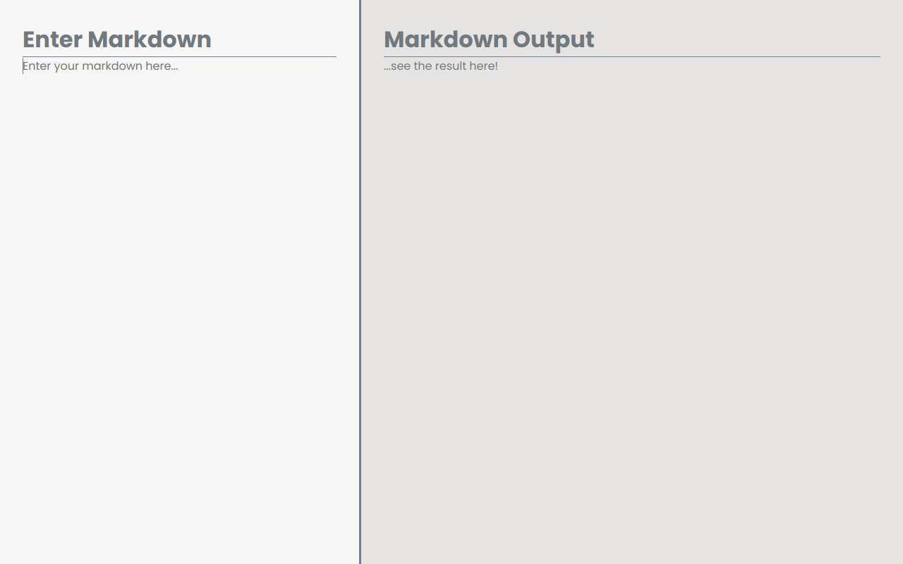

<h1 align="center">
    A simple Markdown editor
</h1>

  
   
  
   
    

    <a href="https://markdown-editor-six-sable.vercel.app/" target="_blank">Click here to see the live demo!</a>&nbsp;&nbsp;&nbsp;

## :rocket: What is Markdown?
- [Markdown basic syntax](https://reactjs.org/)

## :rocket: Functionality
- Converts markdown to formatted text;

## :rocket: Technologies

- [ReactJS](https://reactjs.org/)
- [TypeScript](https://www.typescriptlang.org/)
- [Remarkable](https://www.npmjs.com/package/remarkable)
- [html-react-parser](https://www.npmjs.com/package/html-react-parser)

Made with ♥ by Carlos :wave: [Get in touch!](https://www.linkedin.com/in/kdumagalhaes/)
